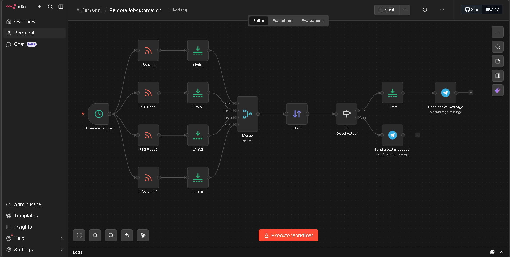
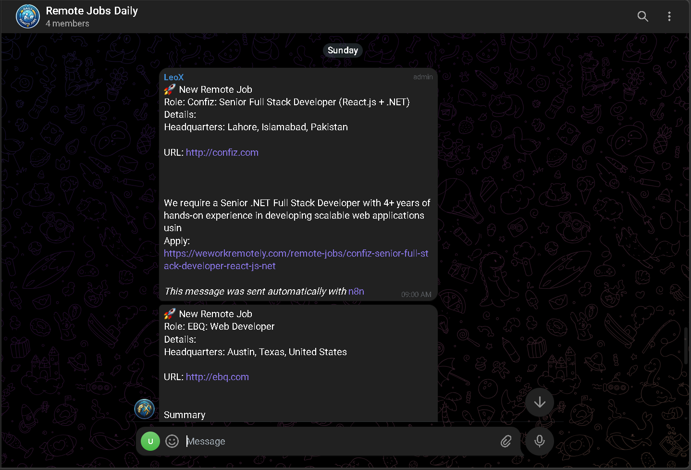
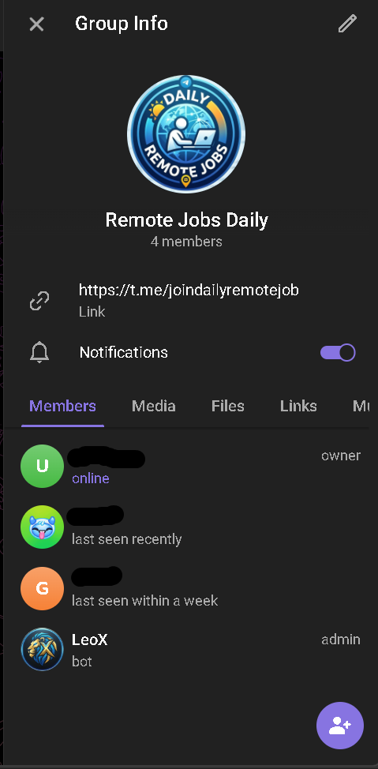

# 🚀 LeoX - AI Job Automation Bot

LeoX is an automated job aggregation system built using n8n that collects the latest remote IT jobs and delivers them directly to a Telegram group.

---

## ⚙️ Features

* Fetches jobs from multiple trusted RSS sources
* Filters only recent jobs (last 24 hours)
* Sorts jobs based on latest posting time
* Sends only top 4 curated jobs
* Automatically handles no-job scenarios
* Runs daily at **9 AM** without any manual effort

---

## 🧠 How It Works

1. A schedule trigger runs the workflow every day at 9 AM
2. Multiple RSS feeds collect job data from different platforms
3. Each feed is limited to avoid overload
4. All jobs are merged into a single list
5. Jobs are sorted by latest posting time
6. Only jobs from the last 24 hours are filtered
7. Top 4 latest jobs are sent to Telegram

👉 This ensures that only **fresh and relevant jobs** are delivered every day.

---

## 🔄 No Jobs Handling

If no new jobs are found in the last 24 hours, the system does not fail.

Instead, it automatically sends a fallback message in the Telegram group to inform users that no new opportunities are available at the moment.

This makes the system **reliable and user-friendly**.

---

## 🛠️ Workflow Architecture

Below is the complete automation workflow built in n8n:

---

## 📲 Telegram Output

Here is how the jobs are delivered inside the Telegram group:

---

## 🤖 Bot Admin Setup

The bot (**LeoX**) is added as an admin in the Telegram group to ensure it can send messages automatically:

---

## 🤖 Bot Info

Bot Name: **LeoX**

Join Telegram Group:
👉 https://lnkd.in/gvjrm9YN

💡 You can join the group to see the automation in action and receive daily job updates.

---

## ⚡ Tech Stack

* n8n (Workflow Automation)
* Telegram Bot API
* RSS Feeds

---

## 📌 Note

This repository showcases the workflow and concept of the project.

The actual workflow JSON and credentials are not included for security reasons.

---

## 💡 Use Case

This project is useful for:

* Job seekers looking for remote opportunities
* Developers exploring automation workflows
* Anyone interested in no-code/low-code tools

---

## ⭐ Project Highlights

* Fully automated job delivery system
* Real-world use case
* Clean and scalable workflow design
* Daily updated job feed without manual effort

---
